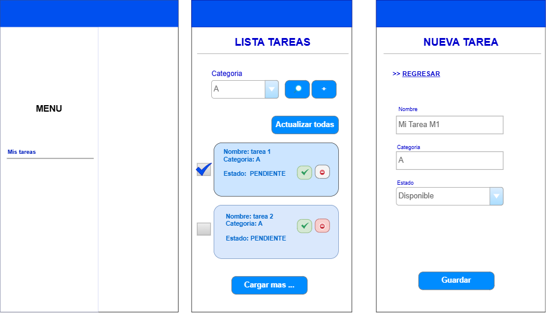
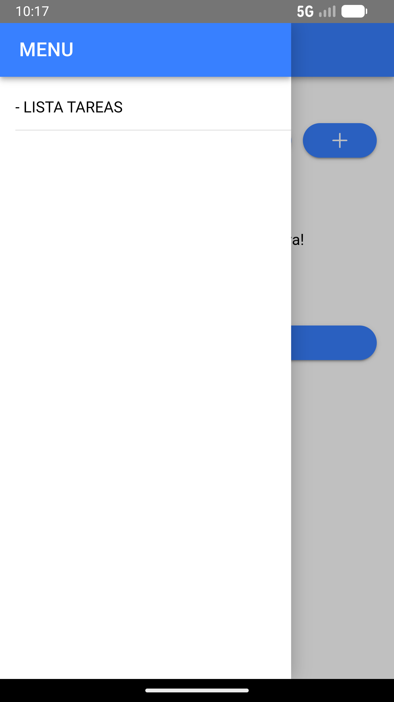
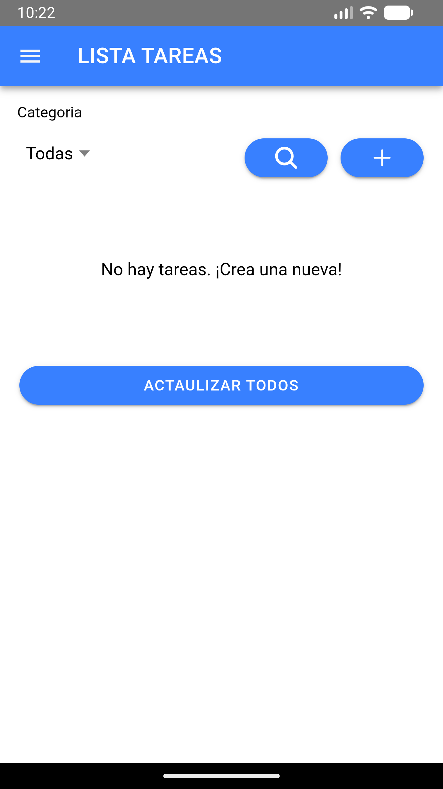
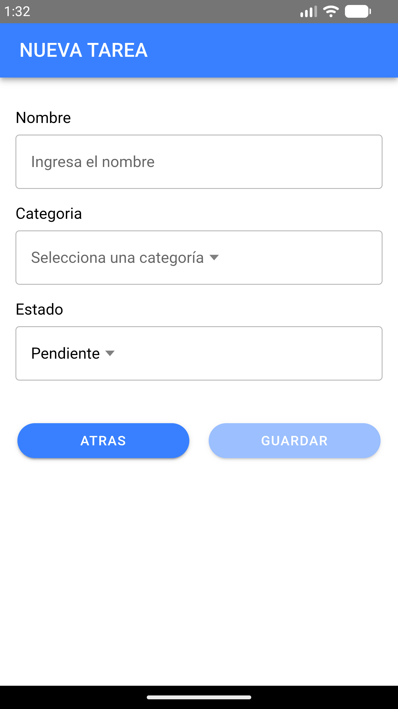
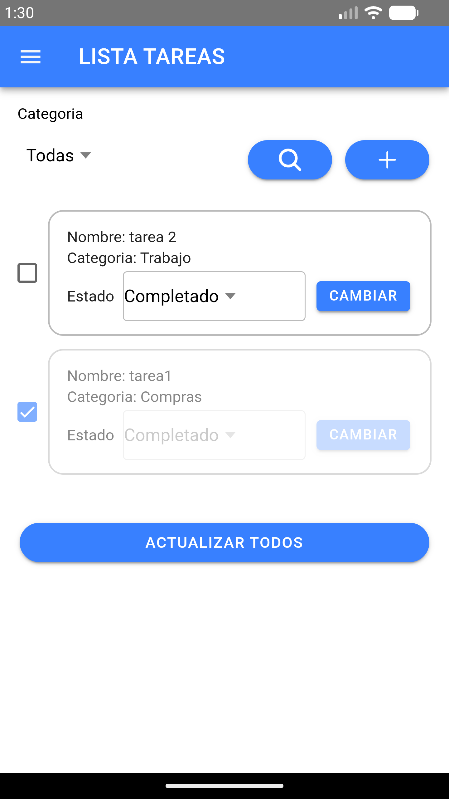
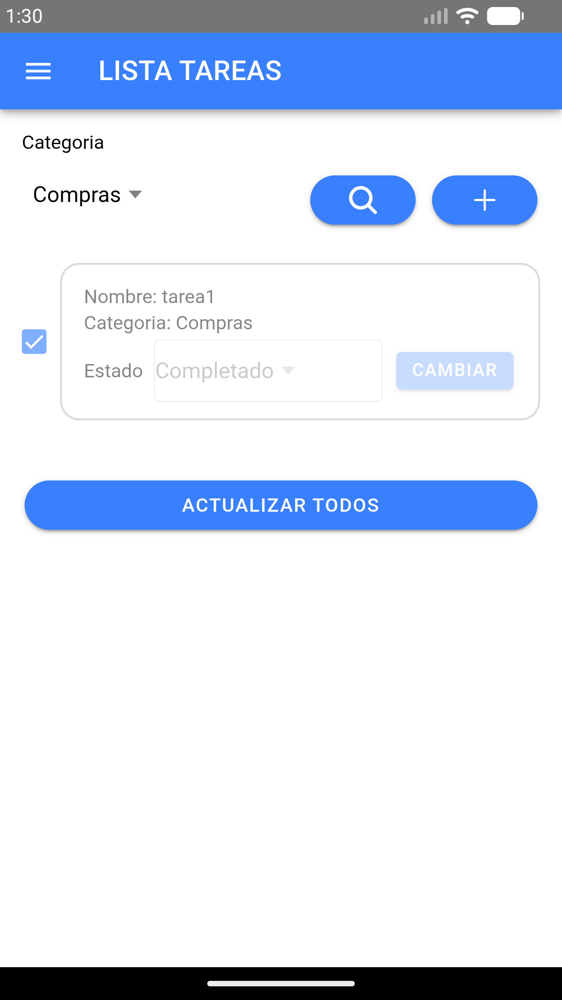
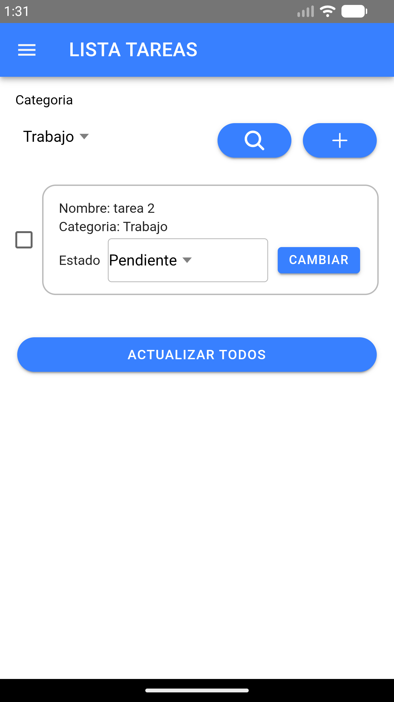

# Todo Assessment App

Aplicación de gestión de tareas (To-Do) construida con **Ionic 7 + Angular 18 + Capacitor 6**, siguiendo principios de **Clean Architecture**. Disponible como app web, Android e iOS.

## Tecnologías

| Herramienta | Versión |
|---|---|
| Angular | ^18.2 |
| Ionic Framework | ^7.8 |
| Capacitor | ^6.2 |
| Node.js | ^20.x (LTS) |
| TypeScript | ~5.5 |

## Arquitectura

El proyecto sigue **Clean Architecture** en tres capas:

```
src/app/
├── core/                        # Lógica pura (independiente de Ionic)
│   ├── domain/
│   │   ├── entities/            # Todo (id, title, completed, createdAt)
│   │   └── repositories/        # Contrato abstracto TodoRepository
│   └── usecases/                # CreateTodo, GetTodos, UpdateTodo, DeleteTodo
├── data/
│   └── repositories/            # LocalStorageTodoRepository (implementación)
└── presentation/
    ├── components/todo-item/     # Componente standalone de ítem
    └── pages/todo-list/          # Página principal con Signals
```

**Decisiones de diseño:**
- Componentes **standalone** con imports explícitos de Ionic.
- Estado con **Signals** de Angular (`signal<Todo[]>([])`).
- Inyección de dependencias con `inject()` (no constructor).
- Persistencia vía **localStorage** (swappable por cualquier backend).


## UX App (To-do List)


## Requisitos previos

- Node.js 20 LTS
- npm 10+
- Angular CLI: `npm install -g @angular/cli`
- Ionic CLI: `npm install -g @ionic/cli`
- Android Studio (para builds Android)
- Xcode (para builds iOS — solo macOS)

## Instalación

```bash
npm install
```

## Scripts disponibles

### Desarrollo web

```bash
npm start              # Servidor dev en http://localhost:4200
npm run build          # Build de desarrollo
npm run build:prod     # Build de producción
npm run watch          # Build en modo watch
```

### Calidad de código

```bash
npm run lint           # ESLint
npm test               # Unit tests con Karma + Jasmine
npm run format         # Formatea con Prettier
npm run format:check   # Verifica formato sin modificar
```

### Capacitor — Mobile (recomendado)

```bash
# Primera vez: agregar plataformas
npm run cap:add:android
npm run cap:add:ios

# Sincronizar web → nativo tras cada build
npm run cap:sync

# Build completo + abrir IDE nativo
npm run build:android   # Abre Android Studio
npm run build:ios       # Abre Xcode

# Ejecutar directamente en dispositivo/emulador
npm run cap:run:android
npm run cap:run:ios
```

### Cordova (alternativo)

> Requiere `ionic` CLI global instalado.

```bash
npm run cordova:build:android        # Build debug Android
npm run cordova:build:android:prod   # Build producción Android
npm run cordova:build:ios            # Build debug iOS
npm run cordova:build:ios:prod       # Build producción iOS
npm run cordova:run:android          # Ejecuta en dispositivo Android
npm run cordova:run:ios              # Ejecuta en dispositivo iOS
```

## Flujo de build móvil (Capacitor)

```
ng build --configuration production
        ↓
npx cap sync [android|ios]
        ↓
Android Studio / Xcode
        ↓
APK / IPA
```

## CI/CD — GitHub Actions

El pipeline (`.github/workflows/ci.yml`) se ejecuta en cada push a `main`/`develop` y en PRs:

| Job | Condición | Acción |
|---|---|---|
| **Lint** | Siempre | `npm run lint` |
| **Unit Tests** | Siempre | Karma + ChromeHeadless + cobertura |
| **Build** | Tras lint y tests | `npm run build` + artifact `dist/` (7 días) |


## Entregables

Entregables
- 1. Código fuente de la aplicación actualizado en un repositorio de Git, incluyendo un archivo README que explique cómo ejecutar la aplicación y detalle los cambios realizados.

- 2. Capturas de pantalla o grabaciones de video que muestren las nuevas funcionalidades en acción.













- 3. Respuestas a las siguientes preguntas:

¿Qué técnicas de optimización de rendimiento aplicaste y por qué?
- Uso de almacenamiento local con localstorage
- Uso de signal para intercambio de estados entre los componentes.

¿Cómo aseguraste la calidad y mantenibilidad del código?
Rpta: La calidad en codigo tengo en cuenta separacón de componenentes y clases aplicando elementos como dry, kiss para programar funciones simples y no generan gran tamaño en la clase u componente. Declaración de estructuras, variables y atributos como se define en clean code. Estrcturar la aplicación que separe los componentes presentacionales (pagina) de los componentes reutilizar en la app, utilizar constantes para reutilizar variables dentro de la app que se comparten.

¿Cuáles fueron los principales desafíos que enfrentaste al implementar las nuevas funcionalidades?
Rpta: Como desarrollador web no tuvo un esfuerzo ionic ya que es framework hibrido que usa la tecnologia angular para desarrollar las aplicaciones su diferencia con respecto en angular la directivas cambian ya que en ionic se usa directiva Ej. Ion y angular app pero ambas son basadas en misma estructura. El reto grande desde hace 3 años volver a usar capacitor, volver a leer sobre este runtime y el uso se permite darle capacitor para ejecutar en su maquina nativa las aplicaciones multiplataforma y de configurar un emulador y generar una APK, como comento desde primer empleo aprendi, capacite e inicie con esta tecnologia no genera esas aplicaciones para plataforma movil. Pero su dinamismo con angular me permitio poder desarrollar.

- Siempre desde ionic con capacitor ha sido desafio la configuración del grandle este fue mi mayor desafio me volvi a enfrentar. 

- 4. Archivos APK e IPA generados a partir de la aplicación demo.
Ruta: docs/app-debug.apk